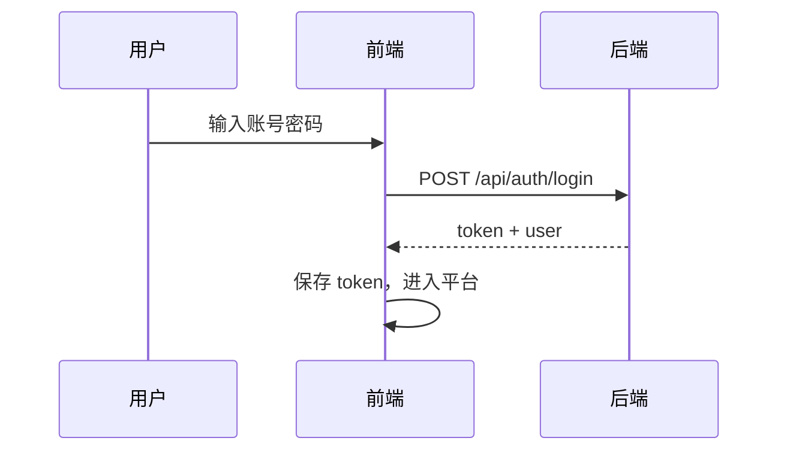
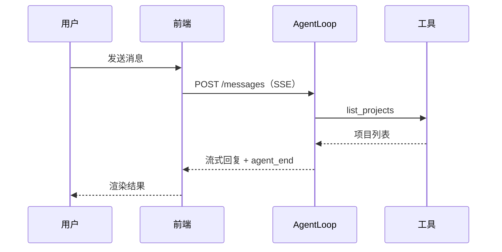
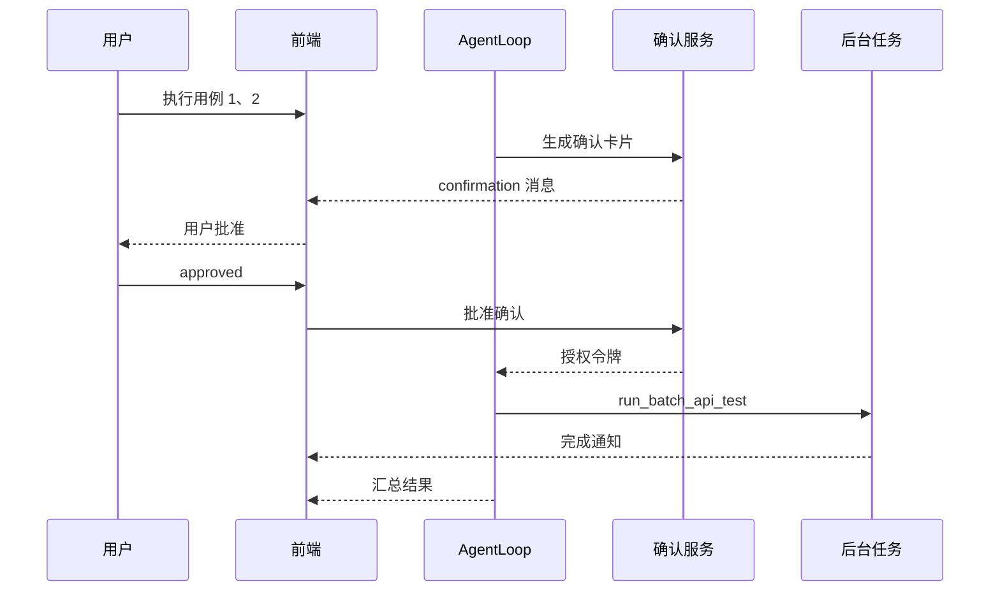
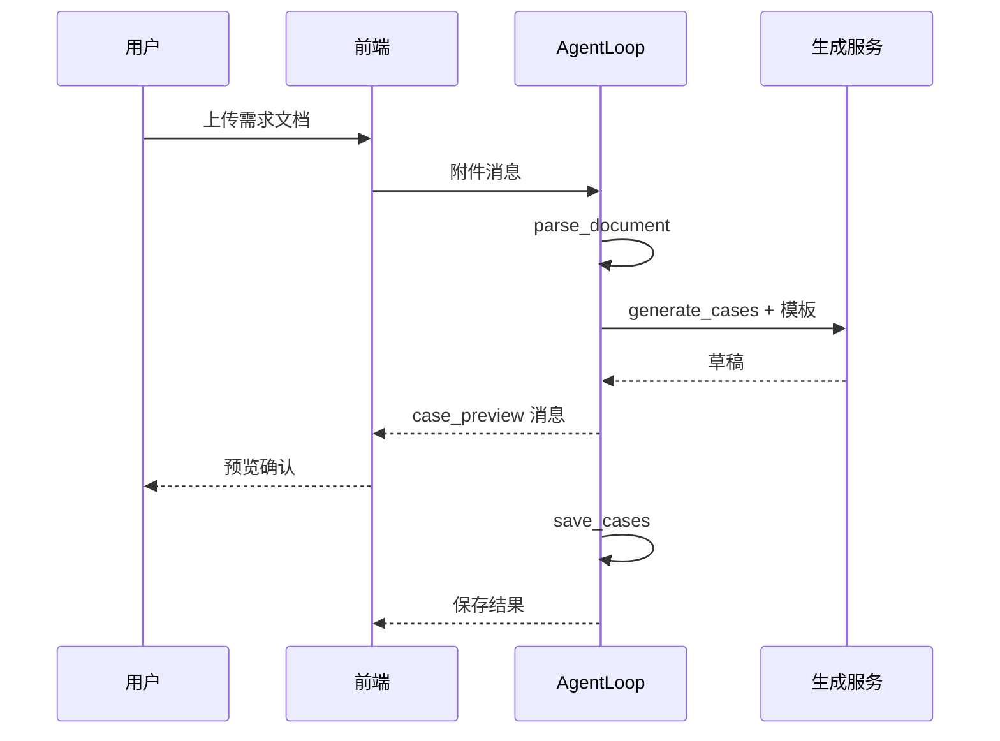
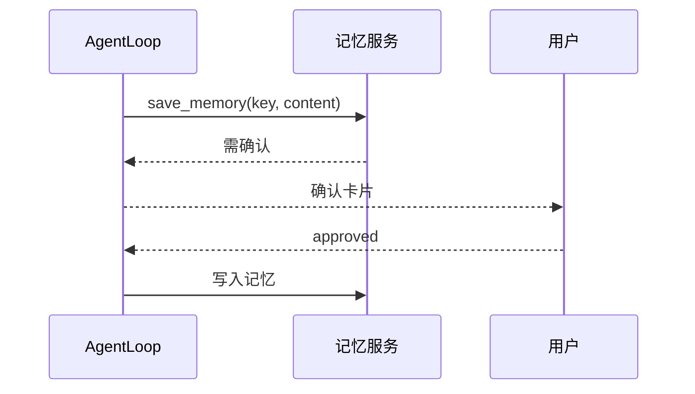

# AutoTestPlatform Agent 实现规格

> 状态：v0.1，供开发 Agent 直接按此文档实现。
> 前置文档：`agent-design.md`（需求）、`technical-blueprint.md`（设计）、`sql/agent_schema.sql`（DDL）、`contracts/agent-contracts.json`（契约）。

## 1. 实现顺序与依赖

```text
阶段 0：认证与基础设施
  -> AUTH-1 用户/登录/JWT
  -> DEPLOY-0 项目骨架、配置、DB 连接
阶段 1：Agent 会话骨架
  -> SESSION-1 会话与消息
  -> STREAM-1 SSE 事件流
  -> LOOP-1 Agent 主循环
阶段 2：工具与执行
  -> TOOL-1 工具注册表
  -> QUERY-1 查询工具
  -> EXEC-1 执行工具 + 确认
阶段 3：生成与资源
  -> FILE-1 文件上传/解析
  -> GEN-1 用例生成/校验/保存
  -> TEMPLATE-1 模板
  -> MEMORY-1 记忆
阶段 4：增强与生产
  -> COMPACT-1 压缩、MIDDLE-1 中间件、SKILL-1 技能
  -> OBS-1 可观测性、CONTRACT-1 契约测试、DEPLOY-1 部署
```

## 2. 后端包结构与任务清单

后端沿用 `backed/AI_Study_Notes`，新增包 `org.example.ai_study_notes.agent.*`：

```text
agent/
  api/           REST + SSE 控制器
  auth/          登录、JWT、用户
  core/          AgentLoop、TurnState、Hooks
  message/       AgentMessage、LLM 转换
  event/         EventStream、SSE Bridge
  session/       会话与消息存储
  tool/          ToolDefinition、ToolRegistry、平台工具
  middleware/    中间件链
  context/       上下文组装、压缩、注入
  memory/        记忆服务
  template/      模板服务
  file/          附件与文档解析
  generator/     用例生成与校验
  config/        AppConfig
  contract/      契约常量（与 JSON 契约对应）
```

### 2.1 P0 任务

| 任务 | 交付物 | 验收 |
| --- | --- | --- |
| AUTH-1 | 用户表、登录/登出/me/users、JWT Filter | 无 token 访问被拒；登录后 user_id 注入上下文 |
| SESSION-1 | 会话 CRUD、消息追加、按用户隔离、7 天过期 | 用户只能看到自己的会话；消息顺序稳定 |
| STREAM-1 | SSE 端点、事件协议、心跳、Last-Event-ID | 断线重连不丢事件 |
| LOOP-1 | AgentLoop、工具分发、停止条件、错误事件 | 多轮工具调用可完成；异常以 error 事件结束 |
| TOOL-1 | ToolRegistry、Schema 校验、统一执行管线 | 未注册/非法参数返回结构化 error |
| QUERY-1 | list_projects/list_use_cases/get_use_case/query_reports | 查询结果结构化返回 |
| EXEC-1 | run_api_test/run_batch_api_test/run_ui_test/run_batch_ui_test + 确认 + 后台任务 | 写/执行必须确认后执行；长任务异步通知 |
| UI-1 | 登录页、axios token、401 跳转 | 未登录无法进入平台 |
| UI-2 | Agent 页面：会话列表、消息流、SSE、上传 | 可完成一次对话查询 |

### 2.2 P1 任务

| 任务 | 交付物 | 验收 |
| --- | --- | --- |
| FILE-1 | 附件上传/列表/删除、文本解析、10MB 限制 | 文件绑定会话并可被对话引用 |
| GEN-1 | parse_document/generate_cases/validate_cases/save_cases | 草稿预览确认后入库 |
| TEMPLATE-1 | 模板 CRUD、生成上下文注入 | 生成结果符合模板约束 |
| MEMORY-1 | 记忆 CRUD、Top-N 注入、覆盖确认 | 跨会话偏好生效 |
| COMPACT-1 | 分层压缩管线、会话摘要 | 长会话不爆上下文 |
| MIDDLE-1 | 中间件链及顺序断言 | 顺序被测试钉住 |
| SKILL-1 | SKILL.md 注册、load/unload、依赖工具激活 | 加载技能后工具池变化 |

### 2.3 P2 任务

| 任务 | 交付物 | 验收 |
| --- | --- | --- |
| ADMIN-1 | 工具/技能/模板启停管理（admin） | 非 admin 无权限 |
| OBS-1 | RunJournal、traceId、token 计量 | 一次 run 可完整回放 |
| CONTRACT-1 | 契约文件与代码双向校验测试 | 单侧修改即 CI 失败 |
| DEPLOY-1 | Dockerfile、nginx SSE 配置、启动脚本 | 部署后 SSE 正常 |

## 3. 前端任务清单

| 任务 | 交付物 | 验收 |
| --- | --- | --- |
| UI-1 | 登录页 + token 管理 + 401 拦截 | 未登录跳登录页 |
| UI-2 | Agent 页面骨架：会话列表 + 聊天工作台 + 上传 | 新建/切换/删除会话正常 |
| UI-3 | SSE 客户端：增量渲染、重连、心跳、取消 | 断网恢复后从 Last-Event-ID 续传 |
| UI-4 | 工具卡片：运行中/成功/失败 + 执行结果展示 | 按元数据渲染，不解析文本 |
| UI-5 | 确认卡片 + 用例预览确认 | 批准后才触发写/执行 |
| UI-6 | 记忆/模板/文件侧栏 | 展示与操作当前会话资源 |

## 4. REST API 契约

统一响应包装沿用现有 `Result<T>`：`code / msg / data`。

### 4.1 登录

```text
POST /api/auth/login
Request:  { "username": "admin", "password": "12345678" }
Response: { "code": 0, "msg": "success", "data": { "token": "<jwt>", "user": { "id": 1, "username": "admin", "role": "admin" } } }
```

```text
POST /api/auth/logout
GET  /api/auth/me
GET/POST /api/auth/users（admin）
```

### 4.2 会话

```text
POST /api/agent/conversations
Request:  { "title": "需求分析" }
Response: { "code": 0, "msg": "success", "data": { "id": 101, "title": "需求分析" } }
```

```text
GET    /api/agent/conversations
GET    /api/agent/conversations/{id}
DELETE /api/agent/conversations/{id}
POST   /api/agent/conversations/{id}/cancel
POST   /api/agent/conversations/{id}/compact
```

### 4.3 消息与流

```text
POST /api/agent/conversations/{id}/messages
Request:  { "content": "查看项目下有哪些用例", "idempotencyKey": "msg-xxx" }
Response: 202 + 后续事件走 SSE
```

```text
GET /api/agent/conversations/{id}/stream?lastEventId=42
Content-Type: text/event-stream
```

### 4.4 文件

```text
POST   /api/agent/conversations/{id}/files  (multipart)
GET    /api/agent/conversations/{id}/files
DELETE /api/agent/conversations/{id}/files/{fileId}
```

### 4.5 确认

```text
POST /api/agent/conversations/{id}/confirmations/{cid}
Request: { "decision": "approved" | "rejected" }
```

### 4.6 模板与记忆

```text
GET/POST /api/agent/templates
GET/POST/DELETE /api/agent/memory
```

## 5. SSE 事件协议

```text
event: agent_start
data: {"runId":"r1","conversationId":101}

event: message_start
data: {"messageId":"m1","role":"assistant","type":"text"}

event: message_update
data: {"messageId":"m1","delta":"正在查询项目..."}

event: tool_execution_start
data: {"toolCallId":"t1","toolName":"list_projects","status":"running"}

event: tool_execution_end
data: {"toolCallId":"t1","toolName":"list_projects","status":"success","durationMs":120}

event: message_update
data: {"messageId":"m2","delta":"共 3 个项目：..."}

event: agent_end
data: {"runId":"r1","stopReason":"stop"}

event: heartbeat
data: {"ts": 1750000000000}
```

规则：

- 事件 id 单调递增，前端按 id 去重。
- 断线重连携带 `Last-Event-ID`。
- 所有失败以 `event: error` + 完整终止序列结束。

## 6. 主流程时序

### 6.1 登录



### 6.2 对话查询



### 6.3 执行测试



### 6.4 用例生成



### 6.5 记忆写入



## 7. 系统提示词示例

```text
你是 AutoTestPlatform 的测试助手。

能力范围：
- 查询项目、API 用例、UI 用例、测试报告
- 执行 API/UI 测试（单个或批量）
- 解析需求文档并生成测试用例
- 使用用例模板约束生成结果
- 记住用户偏好与生成约定

规则：
1. 只使用可用工具完成任务，不编造数据。
2. 查询类操作可直接执行；执行与写入类操作必须先请求用户确认。
3. 工具结果以结构化数据为准，不猜测未返回的字段。
4. 信息不足时先向用户提问，不臆造接口地址或参数。
5. 生成用例必须符合 use_case schema 与当前模板。
6. 涉及执行测试时说明影响范围（用例数、执行次数、并发数）。

当前会话状态：
{会话状态数据块}

相关记忆：
{匹配到的记忆数据块}
```

## 8. 工具 Schema 示例

### list_projects

```json
{
  "name": "list_projects",
  "description": "查询当前平台项目列表",
  "input_schema": { "type": "object", "properties": {}, "required": [] }
}
```

### run_batch_api_test

```json
{
  "name": "run_batch_api_test",
  "description": "批量执行 API 测试用例，需要用户确认",
  "input_schema": {
    "type": "object",
    "properties": {
      "useCaseIds": { "type": "array", "items": { "type": "integer" } },
      "executionCount": { "type": "integer", "minimum": 1, "maximum": 100 },
      "maxConcurrency": { "type": "integer", "minimum": 1, "maximum": 50 }
    },
    "required": ["useCaseIds"]
  },
  "permission": "confirm_execute"
}
```

### generate_cases

```json
{
  "name": "generate_cases",
  "description": "根据需求解析结果与模板生成用例草稿",
  "input_schema": {
    "type": "object",
    "properties": {
      "parsedDoc": { "type": "object" },
      "templateId": { "type": "integer" }
    },
    "required": ["parsedDoc"]
  },
  "permission": "confirm_write"
}
```

## 9. 验收清单

- [ ] 未登录无法访问任何业务与 Agent 接口。
- [ ] 用户只能访问自己的会话、文件、记忆、模板。
- [ ] 读操作无需确认，写/执行操作必须确认。
- [ ] 消息可流式返回，断线可重连续传。
- [ ] 工具未注册、参数非法、执行异常均返回结构化 error。
- [ ] 上传 md/PDF/Word/txt 后可问答并生成用例。
- [ ] 用例草稿预览确认后入库到 use_case。
- [ ] 长批量执行后台化，完成后通过事件通知。
- [ ] 会话保留 7 天，过期自动清理。
- [ ] 契约文件与代码枚举双向校验通过。
